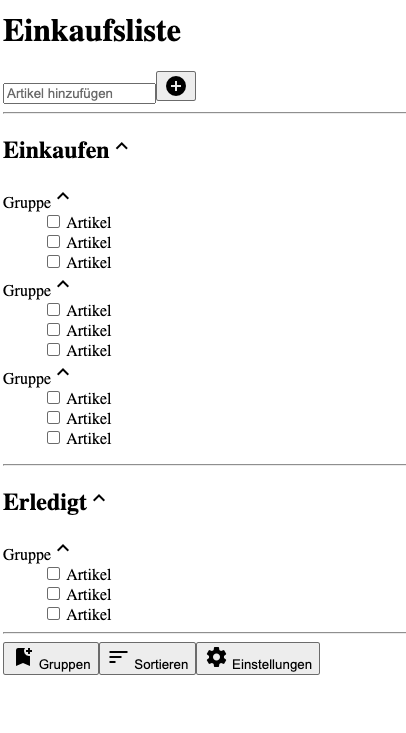

# React
Hinweise zur Bearbeitung:
- Achte auf einen sauberen Quellcode, insbesondere Einrückungen sind wichtig!
- Jede Komponente sollte in einer eigenen `.js`-Datei deklariert werden. 
  Diese werden dann mit `<script>`-Tags importiert.
- HTML und JSX sind sehr ähnlich aber nicht gleich. 
  Du musst eventuell einige Tags anpassen damit dein HTML-Code angezeigt wird.
  Die Fehlermeldungen in der JS Konsole können dir dabei helfen.
---

## Lektion 1
1.) Nutze `<script>`-Tags um die folgenden Skripte zu importieren:
- `react.development.js`
- `react-dom.development.js`
- `babel.min.js`

2.) Nutze `ReactDOM.render()` um die Einkaufliste mithilfe von React anzuzeigen. Kopiere hierfür den HTML-Code
deiner Einkaufsliste in die Funktion und passe ihn gegebenenfalls so an, dass er fehlerfrei angezeigt wird.

3.) Erstelle eine eigene Komponente namens `ShoppingTag` und passe sie so an, dass sie den HTML-Code der gesamten Einkaufsliste enthält. 
Importiere diese Datei im `body` der HTML-Seite mit einem `<script>`-Tag.
Achte darauf, dass er vom Typ `text/babel` ist.
In der `ReactDOM.render()`-Funktion der HTML-Seite sollte jetzt nur noch diese Komponente stehen. 

4.) Erstelle eine eigene Komponente namens `GruppenTag`, lagere den HTML-Code für die Gruppen in die `render()`-Funktion dieses Tags aus.
Ersetze die Gruppennamen("Obst & Gemüse", "Hülsenfrüchte") dabei erstmal durch einen Platzhalter("Gruppe").
Passe den JSX-Code im `ShoppingTag` so and, dass alle Gruppen mithilfe des `GruppenTag` angezeigt werden.

5.) Erstelle eine eigene Komponente namens `ArtikelTag`, lagere den HTML-Code für die Artikel in die `render()`-Funktion dieses Tags aus.
Ersetze die Artikelnamen("Brokkoli", "Reis") dabei erstmal durch einen Platzhalter("Artikel").
Passe den JSX-Code im `GruppenTag` so and, dass alle Artikel mithilfe des `ArtikelTag` angezeigt werden.

---

## Endergebnis

Das Endergebnis sollte ungefähr so aussehen:
>

